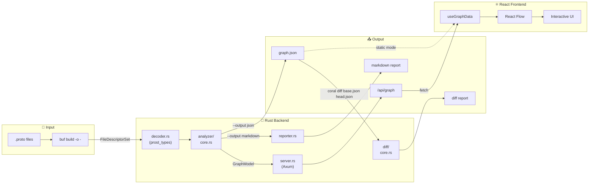

# 🪸 Coral

Proto dependency visualizer for gRPC/Connect projects with a Neon-style interactive Web UI.

[](https://github.com/daisuke8000/coral/actions/workflows/ci.yml)

**[Live Demo](https://daisuke8000.github.io/coral/)**

## Features

- **Interactive Visualization**: React Flow-based graph with zoom, pan, and explore
- **Neon Aesthetics**: Dark mode with glow effects and animated data flow
- **Package Grouping**: Organize nodes by package with expand/collapse functionality
- **Auto Layout**: Automatic graph layout using Dagre algorithm
- **Proto Diff**: Compare two proto snapshots and detect added/modified/removed definitions
- **Markdown Reports**: Generate detailed Markdown output for PR comments
- **Pipeline-Friendly**: `buf build -o - | coral serve` workflow
- **GitHub Action**: Automate proto analysis in your CI/CD pipeline
- **GitHub Pages**: Deploy interactive documentation for your proto files

## Quick Start

### CLI Usage

```bash
# Build from source
git clone https://github.com/daisuke8000/coral.git
cd coral
cargo build --release

# Visualize proto dependencies
cd your-proto-project
buf build -o - | /path/to/coral serve

# Output as JSON
buf build -o - | coral --output json > graph.json

# Output as Markdown report
buf build -o - | coral --output markdown

# Compare two proto snapshots (diff)
coral diff base.json head.json
```

### GitHub Action

Add Coral to your workflow to automatically analyze proto dependencies on every PR:

```yaml
# .github/workflows/proto-analysis.yml
name: Proto Analysis

on:
  pull_request:
    paths:
      - 'proto/**'

jobs:
  analyze:
    runs-on: ubuntu-latest
    permissions:
      contents: read
      pull-requests: write

    steps:
      - uses: actions/checkout@v4

      - name: Analyze Proto Dependencies
        uses: daisuke8000/coral@v0.2.1
        with:
          proto-path: 'proto'
          comment-on-pr: 'true'
          github-token: ${{ secrets.GITHUB_TOKEN }}
```

> **Note**: When using `comment-on-pr: 'true'` on public repositories, proto schema structure (message names, field names, service definitions) will be visible in PR comments. Consider this if your proto files contain internal API specifications.

## GitHub Action Inputs

| Input | Description | Default |
|-------|-------------|---------|
| `proto-path` | Path to proto files directory (must be within the workspace) | `proto` |
| `buf-config` | Path to buf.yaml configuration file (relative to proto-path) | `''` |
| `comment-on-pr` | Post analysis and diff as PR comment | `false` |
| `github-token` | GitHub token for PR comments (requires `pull-requests: write`) | `''` (falls back to `github.token`) |
| `generate-pages` | Generate static HTML for GitHub Pages | `false` |
| `version` | Coral version to download (e.g. `v0.2.1`, defaults to the action ref tag) | `''` |

## GitHub Action Outputs

| Output | Description |
|--------|-------------|
| `json-path` | Path to the generated JSON file |
| `html-path` | Path to the generated HTML directory (if generate-pages is true) |
| `markdown-report` | Detailed markdown report of proto dependencies |
| `diff-report` | Diff report showing changes from base branch |

## Deploy to GitHub Pages

Deploy an interactive visualization of your proto dependencies:

```yaml
# .github/workflows/pages.yml
name: Deploy Proto Docs

on:
  push:
    branches: [main]
    paths:
      - 'proto/**'

permissions:
  contents: read
  pages: write
  id-token: write

jobs:
  build:
    runs-on: ubuntu-latest
    steps:
      - uses: actions/checkout@v4

      - name: Generate Pages
        uses: daisuke8000/coral@v0.2.1
        with:
          proto-path: 'proto'
          generate-pages: 'true'

      - uses: actions/configure-pages@v4
      - uses: actions/upload-pages-artifact@v4
        with:
          path: 'coral-output/html'

  deploy:
    runs-on: ubuntu-latest
    needs: build
    environment:
      name: github-pages
      url: ${{ steps.deployment.outputs.page_url }}
    steps:
      - uses: actions/deploy-pages@v4
        id: deployment
```

## Node Classification

| Type | Condition | Color |
|------|-----------|-------|
| **Service** | Contains `service` definitions | Magenta `#ff00ff` |
| **Message** | `message` definitions | Cyan `#00ffff` |
| **Enum** | `enum` definitions | Yellow `#ffcc00` |
| **External** | Paths starting with `google/` or `buf/` | Gray `#666666` |

## Development

```bash
# Build
cargo build --release

# Test
cargo test

# Run with sample protos
cd sandbox && buf build -o - | ../target/release/coral --output summary
```

### UI Development

```bash
cd ui
npm install
npm run dev        # Development server
npm run build      # Production build
npm run build:static  # Static build for GitHub Pages
```

## Architecture

```
coral/
├── src/
│   ├── main.rs              # CLI entry point
│   ├── lib.rs               # Public API
│   ├── error.rs             # Error types (thiserror)
│   ├── decoder.rs           # Protobuf decoding
│   ├── analyzer/            # FileDescriptorSet → GraphModel
│   │   ├── mod.rs           # Module exports
│   │   ├── core.rs          # Analyzer struct + orchestration
│   │   ├── node_builder.rs  # Node creation (Service, Message, Enum)
│   │   ├── edge_builder.rs  # Edge creation + deduplication
│   │   ├── util.rs          # Type resolution helpers
│   │   └── tests.rs         # Analyzer tests
│   ├── diff/                # Proto snapshot comparison
│   │   ├── mod.rs           # Module exports
│   │   ├── core.rs          # Diff types + compute logic
│   │   ├── markdown.rs      # Markdown rendering
│   │   └── tests.rs         # Diff tests
│   ├── reporter.rs          # Markdown report generation
│   ├── server.rs            # Axum web server
│   └── domain/              # Domain models (Node, Edge, GraphModel)
├── ui/                      # React + Vite frontend
└── action.yml               # GitHub Action definition
```

## Data Flow



## License

MIT
